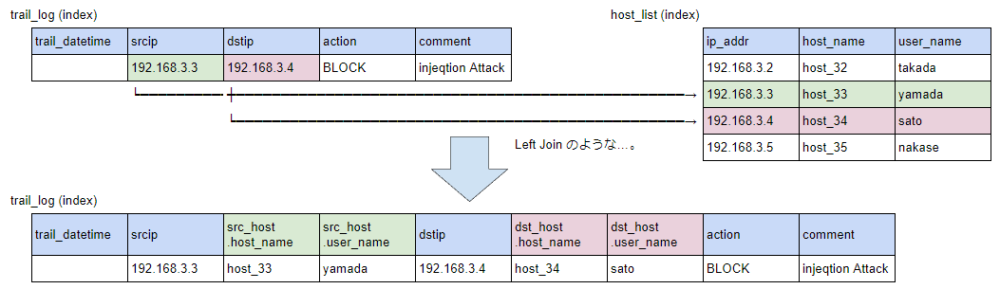
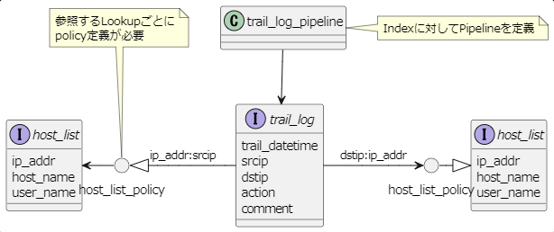
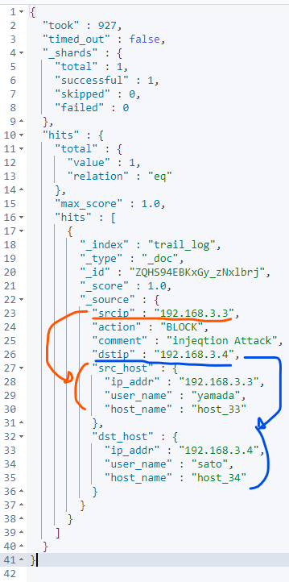

# 概要
## やりたいこと

ElasticSearchの「Enrich Processor」を使用して、別表を参照する機能（Lookup）を実現する。



＜ポイント＞

- RDBとの次の違いをよく理解しておくこと。  
  × ：Document参照(GET)時に、Lookupを参照して情報が付加される  
  〇：Document登録(POST)時に、Lookup情報を伴って格納される  
  ※ そのため、後からLookupの内容を変更しても、登録済のDocumentに対しては変更内容が反映されないこと。

- Lookup（参照先）に、ひとつの「Enrich Policy」の作成が必要であること  
（複数から参照されるLookupでも、原則ひとつあればよい）  

- Index（参照元）に、ひとつの「Pipeline」の作成が必要であること  
（複数のLookupを参照する場合でも、原則ひとつあればよい）  

## データ相関

今回の例では、同じ「host_list」を「srcip（送信元IP）」「dstip（送信先IP）」二つの項目から参照している。  


<br>

# 流れ

大きく、次のステップが必要である。

### Pipelineの作成 
 1. Lookup(host_list)のPolicyを作成
 2. 作成したPolicyをElasticに適用する ※enrich indexの作成
 3. Index(trail_log)のパイプラインを作成する

### Indexへのデータ登録・参照 
 4. Index(trail_log)へDocumentを登録する
 5. Index(trail_log)からDocumentを取り出す

<br>

# 実行ステップ

## <font color="lightgreen">（前準備．Lookup、Indexを作成）</font>

### Lookup「host_list」を作成

``` json
DELETE /host_list/
PUT /host_list/
{
  "mappings":{
    "properties": {
      "ip_addr":{
        "type": "keyword"
      },
      "host_name":{
        "type": "keyword"
      },
      "user_name":{
        "type": "keyword"
      }
    }
  }
}
```

### Lookup「host_list」にデータ追加
``` json
POST /host_list/_doc 
{
  "ip_addr":"192.168.3.2",
  "host_name":"host_32",
  "user_name":"takada"
}
POST /host_list/_doc 
{
  "ip_addr":"192.168.3.3",
  "host_name":"host_33",
  "user_name":"yamada"
}
POST /host_list/_doc 
{
  "ip_addr":"192.168.3.4",
  "host_name":"host_34",
  "user_name":"sato"
}
POST /host_list/_doc 
{
  "ip_addr":"192.168.3.5",
  "host_name":"host_35",
  "user_name":"nakase"
}
```

### 監視ログIndex「trail_log」を作成する
``` json
DELETE /trail_log/
PUT /trail_log/
{
  "mappings": {
    "properties": {
      "trail_datetime" : {
        "type" : "date"
      },
      "srcip": {
        "type" : "keyword"
      },
      "dstip":{
        "type": "keyword"
      },
      "action":{
        "type": "keyword"
      },
      "comment":{
        "type": "text"
      }
    }
  }
}
```

<br>

## <font color="lightgreen">Pipelineの作成</font>
### Lookup のPolicyを作成

``` json
DELETE /_enrich/policy/host_list_policy
PUT /_enrich/policy/host_list_policy
{
  "match": {
    "indices": "host_list",
    "match_field": "ip_addr",
    "enrich_fields": ["host_name" ,"user_name"]
  }
}
```

### 作成したPolicyをElasticに適用する　※enrich indexの作成
``` json
POST /_enrich/policy/host_list_policy/_execute
```

### 監視ログIndex「trail_log」のパイプラインを作成する

pipeline（Index登録時にLookupを参照する指示）を定義する。  
複数のLookupを参照する場合は、下のように複数のProcessorを配列として設定する。

``` json
DELETE /_ingest/pipeline/trail_log_pipeline
PUT /_ingest/pipeline/trail_log_pipeline
{
  "processors": [
    {
      "enrich": {
        "policy_name": "host_list_policy",
        "field": "srcip",
        "target_field": "src_host",
        "description": "host_list join by srcip",
        "max_matches": 1
      }
    },
    {
      "enrich": {
        "policy_name": "host_list_policy",
        "field": "dstip",
        "target_field": "dst_host",
        "description": "host_list join by dstip",
        "max_matches": 1
      }
    }
  ]
}
```

#### 項目説明

|Key名|必須|設定内容| 
|--|--|--|
|policy_name|〇|Policyを指定|
|field|〇|Index側の参照キーを指定|
|target_field|〇|結合後の出力項目名を指定|
|description|-|備考|
|max_matches|-|引当時の取得件数|

詳細は以下の公式ドキュメントを参照のこと。  
[Elasticsearch Guide [8.3] » Ingest pipelines » Ingest processor reference » Enrich processor](https://www.elastic.co/guide/en/elasticsearch/reference/current/enrich-processor.html)

<br>

## <font color="lightgreen">Document（trail_logデータ）の追加と参照</font>
### 監視ログIndex「trail_log」にデータを追加する

データ登録のPOSTのクエリパラメタとして、「?pipeline=（前述で作成したパイプライン名）」を指定すること。  

例）POST /trail_log/_doc/**<font color="red">?pipeline=trail_log_pipeline</font>** 
``` json
POST /trail_log/_doc/?pipeline=trail_log_pipeline
{
  "srcip":"192.168.3.3",
  "dstip":"192.168.3.4",
  "action":"BLOCK",
  "comment":"injeqtion Attack"
}
```

### 監視ログIndex「trail_log」のデータを確認する
``` json
GET /trail_log/_search
```

## 実行結果
下のとおり、データが取得できる。
 - 「srcip」に対して「src_host」情報が取得されている。
 - 「dstip」に対して「dst_host」情報が取得されている。



## 参考
- [enrich processorの使い方について](https://qiita.com/hamingcode/items/d8cd71d28b14c1aae6e5)
- [Elasticsearch Guide [8.3] » Ingest pipelines](https://www.elastic.co/guide/en/elasticsearch/reference/current/ingest.html)
